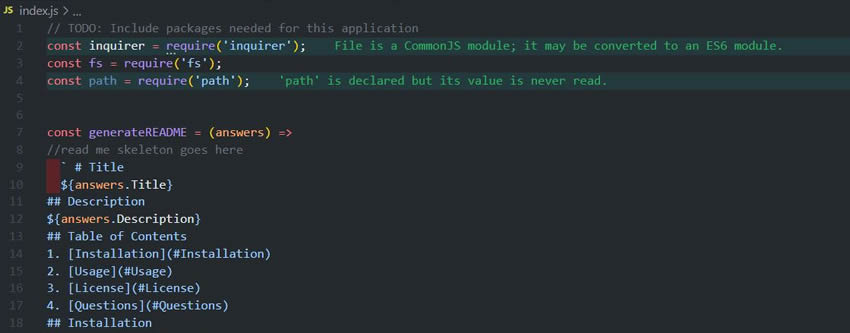

# 09-Good-README-Generator
## Introduction:
Our task was to create a command-line application. That dynamically generates a new README.md file from a user's input using the Inquirer package. While it’s not a well kept secret, it’s important to have a high-quality README for all apps that we create.

 A README file is like a manual. It should include what the app is for, how to use it, how to install, to report issues, and how to make contributions to the app. 


I created a demo that you can view on this link:
 [Good README Generator Demo](https://drive.google.com/file/d/1BLbe6w9UIov3UzG22q1rq4g9ZKorqRxf/view?usp=sharing/)

<br>
<br>


## Technologies used:

* Java Script
* Iqurer


The application will be invoked by using the following command:
```bash
node index.js
```
<br>
<br>

### Original Java Script  Code


<br>
<br>
